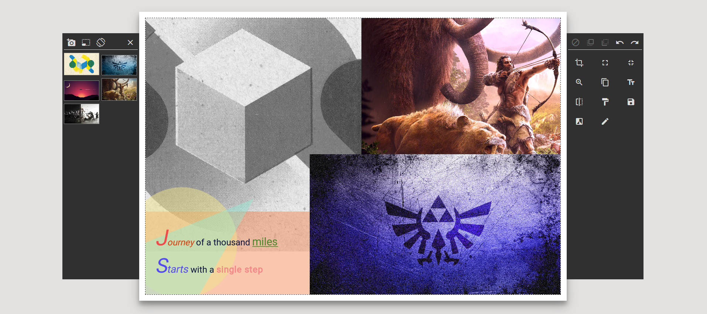
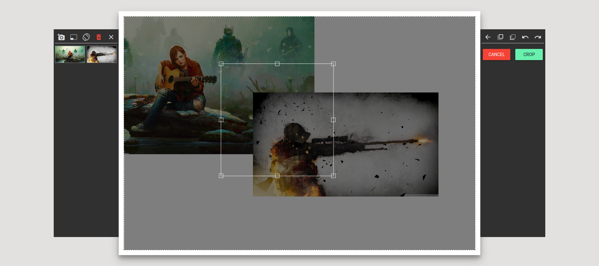
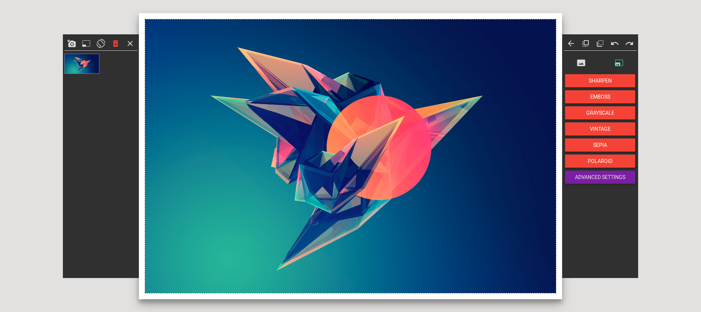
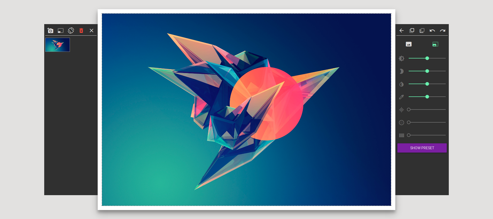
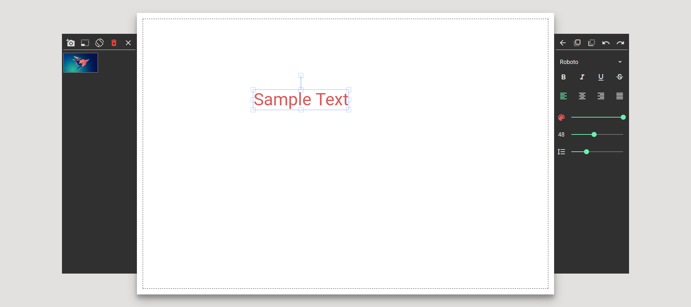
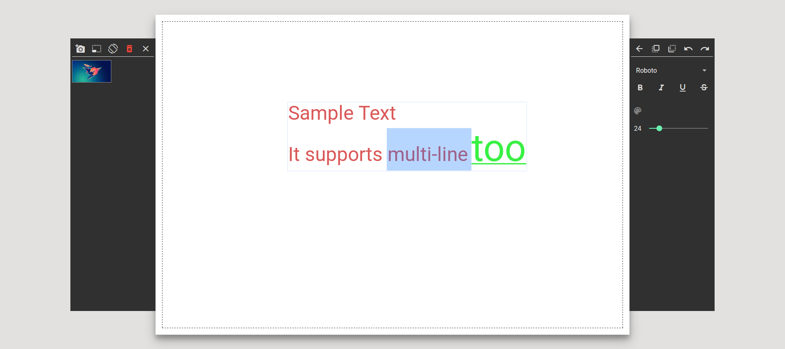
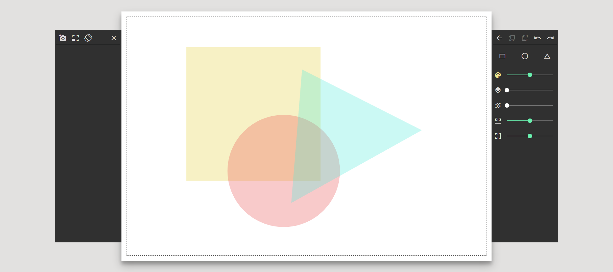
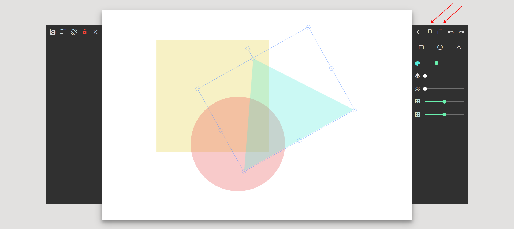

# Photo-Chrome

A fully fledged web based photo editor.

## Image picker

The photo editor comes with the ability to open and handle multiple images simultaneously. Images can be loaded by clicking on the __camera icon__ which opens the file explorer; from which multiple images can be loaded at once. The image picker is a scrollable area where image thumbnails will be shown. User can add the image to the canvas area by clicking on the thumbnail.

## List of tools

| Tool Name | Tool Description |
| --- | --- |
| Cropping tool | Used to crop multiple images at once. |
| Clone tool | Clones the currently active image object along with the styles applied to it |
| Flip tool | Flips image horizontally |
| Filter tool | Applies preset or advanced filters on a selected image or all the images collectively |
| Text tool | Adds a fully customizable multi-line text |
| Shape mask tool | Used to add translucent shape mask to create interesting designs |

## 1. Crop tool

This tool works solely on images and has been done so on purpose as the used would not wish to crop other objects, potentially destroying their meaning; for instance cropping a text object would destroy it's ability to be edited.
On clicking on the cropping tool button, the cropping window opens on the canvas for the user the select the region of the photo to crop. The cropping feature can be applied on multiple photos at once.

The tool bar now changes to provide the user with options to crop or cancel the crop selection. If the user deselects the crop selection, the cropping mode is automatically cancelled.

## 2. Clone tool

Clone tool is as simple to use. Select any image object on the canvas and when the selection is active, clicking on the clone tool will create another copy of the object along with the styles currently applied to it.

**Note:** This tool only works on an active image object selection.

## 3. Flip tool

This flip tool can be used to flip an __image__ horizontally. An option to flip vertically has not provided as normal images don't need vertical flips anyway.

**Note:** This tool only works on an active image object selection.

## 4. Filter tool

The filter tool fancies a set of preset filters for casual users, and a set of advanced tools for power users. The filter tool has two modes - single, global. When an image is in selection, the filter mode is automatically turned on to single and any changes will be applied to the __selected image only__. When no image is selected and filter tool is used, the global mode is used and the filters values are applied to __all the images objects__ present on the canvas.
  

The preset filters are:

* Sharper
* Emboss
* Grayscale
* Vintage
* Sepia
* Polaroid

The advanced filters are:

* Brightness
* Contrast
* Saturation
* Hue
* Noise
* Blur
* Pixelate

## 5. Text tool

This tool is used to add text to the image. It supports multiple type faces, colors & opacity, text styling & alignment, and line height. Clicking on the text tool button, adds a sample text instantly pn the canvas; double clicking on the text box opens it's editable mode for editing the text.  
Applying properties on text box, will apply it to the whole text.

applying properties in editable mode will apply properties to a particular selection. Some properties will not be available in editable mode for obvious reasons.

**Note:** The text properties box is automatically selected as soon as the user selects a text object.

## 6. Shape Mask tool

This tool lets you add predefined shapes, namely rectangle, triangle and circle, giving them different colors and opacity, shadow and shadow offset to produce interesting designs. These designs can be used as background for you text or can be simply used as an accessory to an image.  
Selecting a shape mask will automatically switch to this tool.

## Miscellaneous tools

Other than the basic tools for image editing, the editor also comes packed with some miscellaneous features that might come in handy.

### Stacking sequence

The stacking sequence of an image can be changed, namely brought forward and sent backward. This can be achieved using the two buttons provided at the top of the toolbar component as shown in the image.

